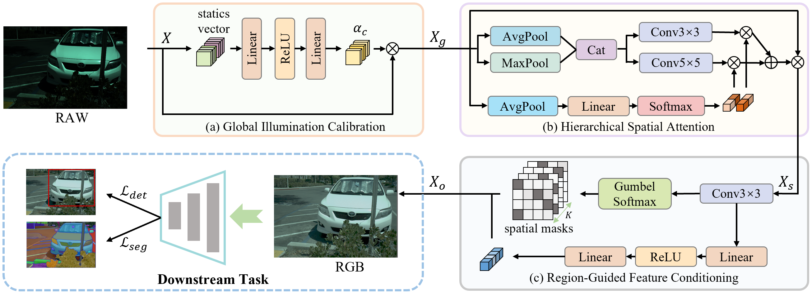
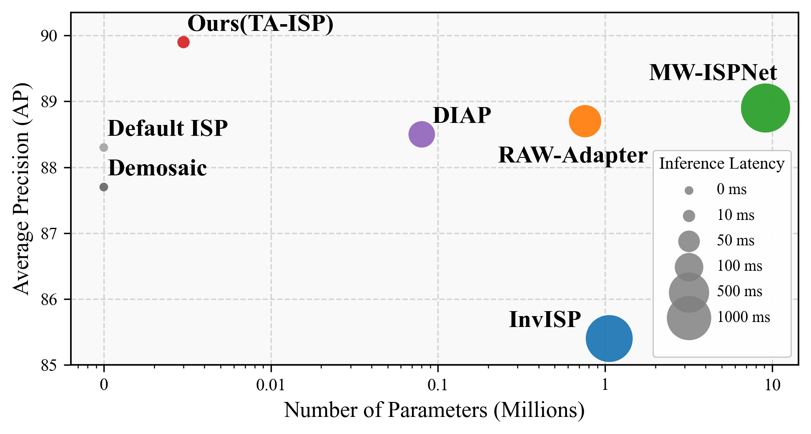

<div align="center">


<h2>
Task-Aware Image Signal Processor for Advanced Visual Perception
</h2>

Kai Chen,  Jin Xiao,  [Leheng Zhang](https://scholar.google.com/citations?hl=zh-CN&user=DH1CJqkAAAAJ),  [Kexuan Shi](https://scholar.google.com/citations?hl=zh-CN&user=dX-aOIwAAAAJ),  [Shuhang Gu](https://scholar.google.com/citations?user=-kSTt40AAAAJ)

[](https://arxiv.org/abs/2509.13762)
[](https://github.com/LabShuHangGU/TA-ISP)

</div>

⭐If you like this work, please help star this repo. Thanks!🤗
 


## Performance
<p align="center">
    
</p>

## 📑 Contents

- [📰 News](#news)
- [🛠️ Pipeline](#pipeline)
- [✅ Status](#status)
- [🥇 Results](#results)
- [📚 Citation](#citation)


## <a name="news"></a> 📰 News
- The code will be coming soon.

<!-- - **2025-05-20:** Our MVAR paper has been published on arXiv. -->


<!-- ## <a name="pipeline"></a> 🛠️ Pipeline

Our MVAR introduces the **scale and spatial Markovian assumpation** which only adopt adjacent preceding scale for next-scale prediction and restricts the attention of each token to a localized neighborhood of size k at corresponding positions on adjacent scales.

<p align="center">
    
</p>

## <a name="todo"></a> ✅ Status

- [x] 📄 Paper available on arXiv  
- [ ] 🧠 Codebase under preparation  
- [ ] 🚀 Planned improvements and model refinement


## <a name="results"></a> 🥇 Results

Our MVAR model achieves a **3.0× reduction** in GPU memory footprint compared to VAR. Detailed results can be found in the paper.

<details>
<summary>Comparison of Quantitative Results: MVAR vs. VAR (click to expand)</summary>

<p align="center">
  
</p>
</details>

<details>
<summary>Quantitative Results on the ImageNet 256×256 Benchmark (click to expand)</summary>

<p align="center">
  
</p>
</details>

<details>
<summary>Ablation Study on Scale and Spatial Markovian Assumptions (click to expand)</summary>

<p align="center">
  
</p>
</details>


## <a name="cite"></a> 🥰 Citation

Please cite us if our work is useful for your research.

```
@article{zhang2025mvar,
  title={MVAR: Visual Autoregressive Modeling with Scale and Spatial Markovian Conditioning},
  author={Zhang, Jinhua and Long, Wei and Han, Minghao and You, Weiyi and Gu, Shuhang},
  journal={arXiv preprint arXiv:2505.12742},
  year={2025}
}
```


## Contact

If you have any questions, feel free to approach me at jinhua.zjh@gmail.com -->
